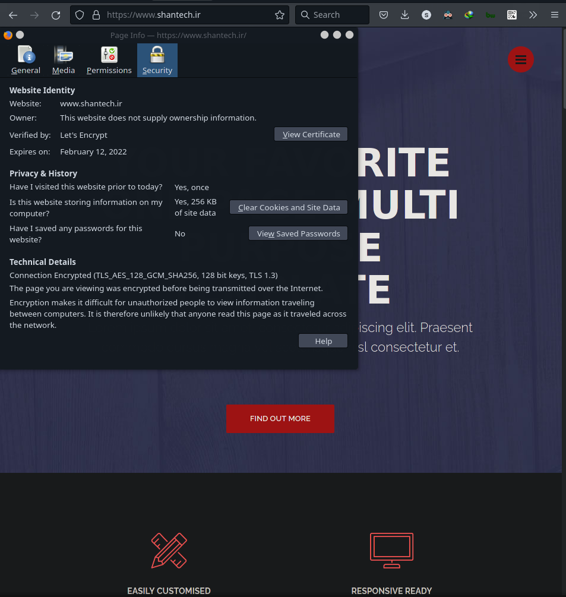
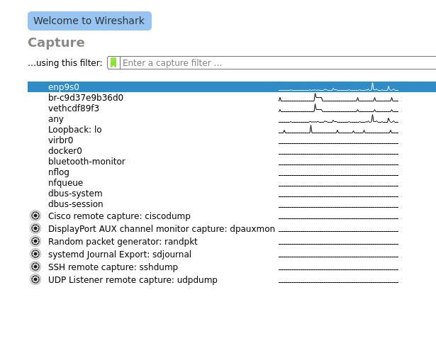
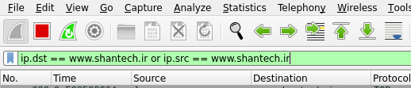
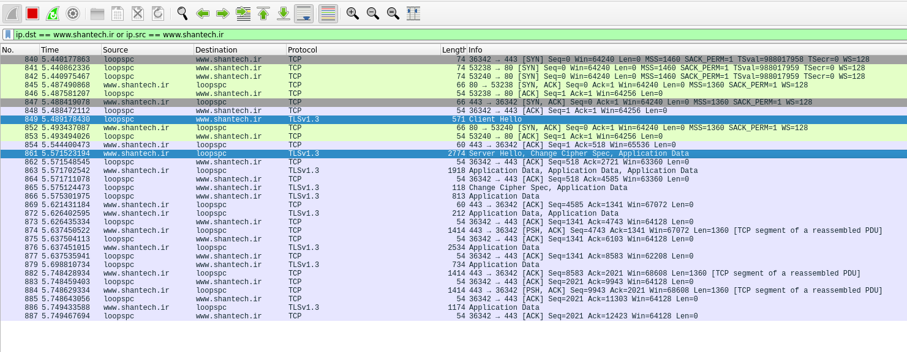
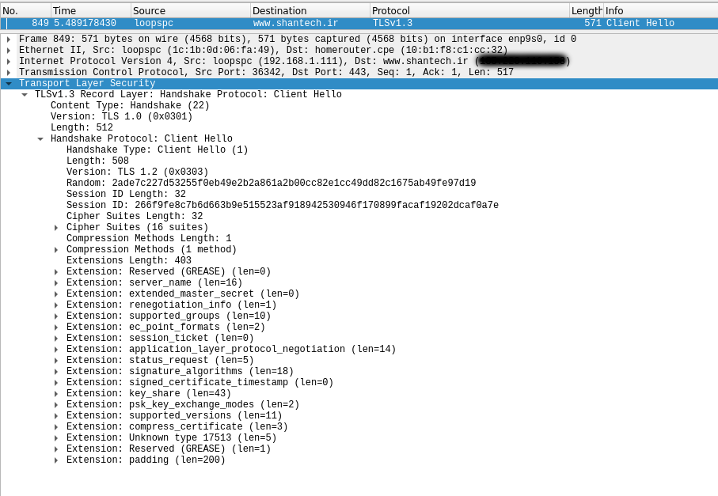
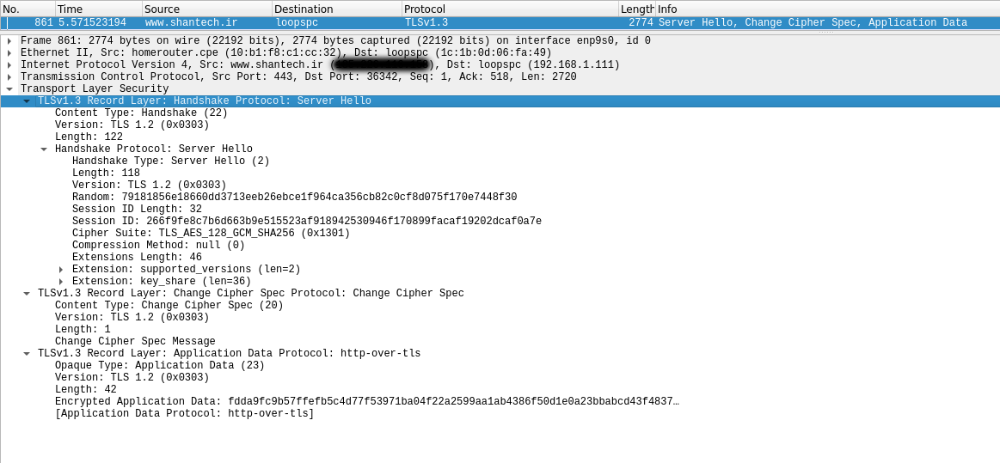
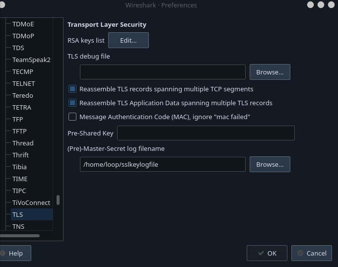
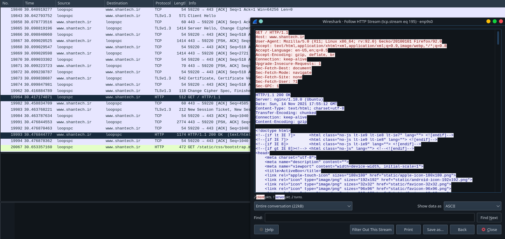

## Single Page Website Secured With TLS

- [x] Add the Page
- [x] Add the Server
- [x] Add TLS
- [x] Dockerize
- [x] Nginx
- [ ] Docker Compose

## Question 1
- a
  - https://stackoverflow.com: Let's Encrypt
  - https://github.com: DigiCert, Inc.
  - https://about.gitlab.com: GlobalSign nv-sa
  - https://www.tutorialspoint.com: DigiCert Inc
- b
  - https://stackoverflow.com: no 
  - https://github.com: no 
  - https://about.gitlab.com: no 
  - https://www.tutorialspoint.com: no
- c
  - https://stackoverflow.com: February 2, 2022
  - https://github.com: March 31, 2022
  - https://about.gitlab.com: November 19, 2022 
  - https://www.tutorialspoint.com: December 1, 2022
- d
  - https://stackoverflow.com: SHA-256 with RSA Encryption 
  - https://github.com: ECDSA with SHA-256 
  - https://about.gitlab.com: SHA-256 with RSA Encryption
  - https://www.tutorialspoint.com: SHA-256 with RSA Encryption
- e
  - https://stackoverflow.com: RSA 
  - https://github.com: Elliptic Curve P-256
  - https://about.gitlab.com: RSA
  - https://www.tutorialspoint.com: RSA
- f
  - https://stackoverflow.com: extracted with openssl
```
-----BEGIN PUBLIC KEY-----
MIIBIjANBgkqhkiG9w0BAQEFAAOCAQ8AMIIBCgKCAQEAnnR4op27mxXFQRA/b1b4
zCn/KPr3NDX3grqVZQOC35WpvvT+qxhZZb+0GQpf5KWe9dbTDefE1CIudlclo5yI
oe0cPwyKt0mknvuVyJb+UexDrg1b6jBY7c1OHV5gDklUi48v9YNbBiCYs1HssnVg
VwkYhVrcxtAoc3KlQO8NJ5rT/cy90U0lCd2pXaY4GA8hOWt6OXUyHgHyd7+Khm0M
ZkbqleQL4cQ5McbPM5PG2EahQacV2INXXNRwiyRtoh7f8KahlzBHfHwOnYeyfAQm
5GmUOuPROSroSn9+KvaX0MI3li4pK7VZTkp+IvN6cmBBAQdrLVbgu+EROiqEQei+
tQIDAQAB
-----END PUBLIC KEY-----
```
  - https://github.com: extracted with openssl
```
-----BEGIN PUBLIC KEY-----
MFkwEwYHKoZIzj0CAQYIKoZIzj0DAQcDQgAErfb3dbHTSVQKXRBxvdwlBksiHKIj
Tp+h/rnQjL05vAwjx8+RppBa2EWrAxO+wSN6ucTInUf2luC5dmtQNmb3DQ==
-----END PUBLIC KEY-----
```
  - https://about.gitlab.com: extracted with openssl
```
-----BEGIN PUBLIC KEY-----
MIIBIjANBgkqhkiG9w0BAQEFAAOCAQ8AMIIBCgKCAQEA1kqNHs4jf9JauXSHEu2X
HicNqHc2Xk9LUZHChFvImoDbpeiXraxZZOoeZcaCxLt+fjCuv31hzZre7nkJOx0t
LkYqbJAM3hqy9R75PBIyHB1108aUbuyaljru2Ul8DcVuXKp+y/fzdoGMLSYP7H5L
/QBUIjTnSq2qyn23AbLcZq2uq0G4eYICxuVAU9tzeGawN1587xMd/ho7Trv2uYs2
5OxUD94Mlysn5v0kEaTbMrWGvYyaruR5ss32qeSmrnjiW7SRDpPHUfx1kYv4JgFH
r6utjDcaK2G8/GFPz9eOvLUu4jkZA99U3NkFgjEEj8muahmghp8+3VYFshNcUz2w
VwIDAQAB
-----END PUBLIC KEY-----
```
  - https://www.tutorialspoint.com: extracted with openssl
```
-----BEGIN PUBLIC KEY-----
MIIBIjANBgkqhkiG9w0BAQEFAAOCAQ8AMIIBCgKCAQEAtnVz0wp+fYpFksH2WAQp
gy/0tJVy5wDrxaOFXDJbWbcb/zZeTaSj7k3KxMLHgOM15FHYRmQjE3ZhoLZ14ac5
7uvojQyJBWu+3mIELrxI+bHJsFLRenAW84nOkWqXDdQjw/x0rf0T14Pm3L7MlIck
EkvnS84zUO2MN84FC9MZVAyDKjl7dKIF6LyQQwl85WajnGctmPcSV0mOhUrXylhg
N84SSSFaXsl5ukpC2j5OMoVvPwBsnuvh3YKbOmJLvofxWzBZR3c9qEufBNi81MbS
8RQi/Hk5/m0k1J6bkD6Wib5kFw5mbTz81M3XCosdb35X04/czr5TKMhHIwsmF12c
SQIDAQAB
-----END PUBLIC KEY-----
```
## Question 2
[giallery.com](https://giallery.com/) found [here](https://www.sigmamedia.net/badssl/Iran%20(Islamic%20Republic%20of).html). certificate is also included along side this report.

## Question 3

- en.wikipedia.com: extracted with openssl
  - Serial Number: 031A6B6D125D7706BC61A22BCE280534
      Revocation Date: Jun 17 15:09:35 2021 GMT
  - Serial Number: 0C40FB9449BF2E9D2F2912BE9CA27924
      Revocation Date: Jun 17 15:09:36 2021 GMT
  - Serial Number: 04B439CB22317491A5AB479E9F5BB629
      Revocation Date: Jun 22 15:14:56 2021 GMT
  - Serial Number: 0E066FD67EEC3E47699DAC681C4A2D5B
      Revocation Date: Jun 22 15:38:18 2021 GMT
  - Serial Number: 0A461ABB1944D9E52D7AC59FB13238C9
      Revocation Date: Jun 29 16:13:31 2021 GMT
- dictionary.com: no crl uri was provided by the certificate

## Question 4

### What I've Done, TL;DR
- First we need a webserver which is located at `main.go` serving the contetns of `static` directory which contains `index.html`. This is signle page website and nothing more. The websever's code is also super simple.
- After that we had a website running, it was time to Dockerize the project with image name being `sinashk/tlswebsite`.
- I also tried to use `docker-compose` and move `nginx` and `website` on there but had some issues and failed in doing so.
- The used a domain `shantech.ir` on virtual machine from arvan cloud and got a certificate from let's encrypt and configured nginx.

### Steps in Securing With SSL
Keep in mind that the packages used are for ubuntu server you might have the same packages or not, check the name of these packages in you own linux distribution.
- first updated my DN recored with arvans dns.
- then sshed into the server and did some updates and installed `nginx` and `certbot` and `python3-certbot-nginx`
- then created `www.shantech.ir.conf` inside `/etc/nginx/conf.d/` and inside it was this content:
```
# file /etc/nginx/conf.d/www.shantech.ir.conf
server {
    listen 80 default_server;
    listen [::]:80 default_server;
    root /var/www/html;
    server_name shantech.ir www.shantech.ir;
}
```
- then we reload `nginx`. I had some problems with this operation saying configuration already exists. The reason was that my config was listening to `default_server`, so as 2 other config scratered around. I simply deleted them you can change the `default_server` to something else both work.
```
$ sudo nginx -t && nginx -s reload
```
- then ran the following command with `certbot` to generag certificates and also update `www.shantech.ir.con.conf`
```
sudo certbot --nginx -d shantech.ir -d www.shantech.ir
```
- After this operation certbot asked to update the nginx config so that it would redirect all http traffic to https and i said yes. the final config is included in the root directory of the project with the name `nginx.conf`.
- Now just update the config and your locations. I added `/` to go to `localhost:8080` which im going to run the webserver on that port later. this is the the part i added:
```
# file /etc/nginx/conf.d/www.shantech.ir.conf
erver {
    root /var/www/html;
    server_name shantech.ir www.shantech.ir;

    listen [::]:443 ssl ipv6only=on; # managed by Certbot
    listen 443 ssl; # managed by Certbot
    ssl_certificate /etc/letsencrypt/live/shantech.ir/fullchain.pem; # managed by Certbot
    ssl_certificate_key /etc/letsencrypt/live/shantech.ir/privkey.pem; # managed by Certbot
    include /etc/letsencrypt/options-ssl-nginx.conf; # managed by Certbot
    ssl_dhparam /etc/letsencrypt/ssl-dhparams.pem; # managed by Certbot

################ I ADDED ##################
    location ~ ^/ {
       proxy_pass  http://localhost:8080;
    }
###########################################
}
server {
    if ($host = www.shantech.ir) {
        return 301 https://$host$request_uri;
    } # managed by Certbot


    if ($host = shantech.ir) {
        return 301 https://$host$request_uri;
    } # managed by Certbot


    listen 80 default_server;
    listen [::]:80 default_server;
    server_name shantech.ir www.shantech.ir;
    return 404; # managed by Certbot
}

```
- Then i pulled the image with `docker pull sinashk/tlswebsite`. You might need to login to your account for this one with `docker login` and you might also need a vpn ;)
- After the image was pulled, we can simply run it with:
```
$ docker run -p 127.0.0.1:8080:8080 sinashk/tlswebsite
```
- Well there is one more thing we need block other traffics otherwise some can ignore tls by going straigh to port 8080 so we need to activate our firewall. I will use `ufw`. NOTE: `ufw` cannot prevent traffic to access a port mapped by docker since docker modifies iptables directly. So with an enabled firewall you can still visit `shantech.ir:8080` and bypass `TLS` that's why we need to add `127.0.0.1` at first to restrict the traffic to be coming from the machine itself.
```
# IMPRTANT otherwise you will lose your session and probably won't be able to connect to your sever any more
$ sudo ufw allow ssh 
$ sudo ufw allow https
$ sudo ufw allow http
# now enable the firewall
$ sudo ufw enable
# check you firewall status
$ sudo ufw status
```



- Enjoy your secure website :). It's still sad that i couldn't make docker compose work :(.


## Question 5
First of all this is public ip so i will not share it in this document and configure wireshark to show the domain name instead of IP address. I will also hide the IP in packets. By going to `View > Name Resolution` and checking `Resolve Network Addresses` IP addresses will be replaced by domain name. Now my system's name is `loopspc` so you will see this instead of `192.168.1.111` which is my private IP address.

Now when you open up `wireshark` you will be presented with a list of network devices to select and capture packet on. My network interface is `enp9s0`. You can find yours by running `ip addr` in the `terminal`.



After selecting the interface we need to filter the output because it's not on Loopback and there so many packets we can filter based on destination IP and source IP, and we don't need to specify the IP since we have checked that box before. So type this filter in:
```
ip.dst == www.shantech.ir or ip.src == www.shantech.ir
```



It's kinda weird to see `ip.dst` being equal to `www.shantech.ir` but it is what it is.

Now if we visit `www.shantech.ir` and come back to `wireshark` we will see that there are a lot of packets captured to wireshark.



You can see `Client Hello` and `Server Hello` which belongs to `TLS`. Here is some of the metadata attached to `Client Hello Packet`:



Things like:
- session token
- cipher suites
- suported versions
- ...

And Here is `Sever Hello`:



Things like:
- Selected cipher suit
- Session ID
- ...

Now to decrypt `TLS`, we use `SSL Log File` since it works for most situations. All we need to do is set an environment variable and then open a browser and visit the website.
```
# set the environment variable
$ export SSLKEYLOGFILE=/home/loop/sslkeylogfile

# now open a browser. keep in mind that the browser 
# should be opened from this shell since you set 
# the variable in this shell not hte entire system
$ firefox https://www.shantech.ir
```

Now we just need to point `wireshark` to that file. Go to `Edit > Prefernces` and under protocol section find `TLS` and write the path of the `sslkeylogfile` to `(Pre)-Master-Secret log filename`

 

After saving the changes we can see that packets are decrypted and here is proof of that.





Now after decrypting `TLS` packets, the protocol encapsulated inside of it is visible and you can see it in the above picture as well.


